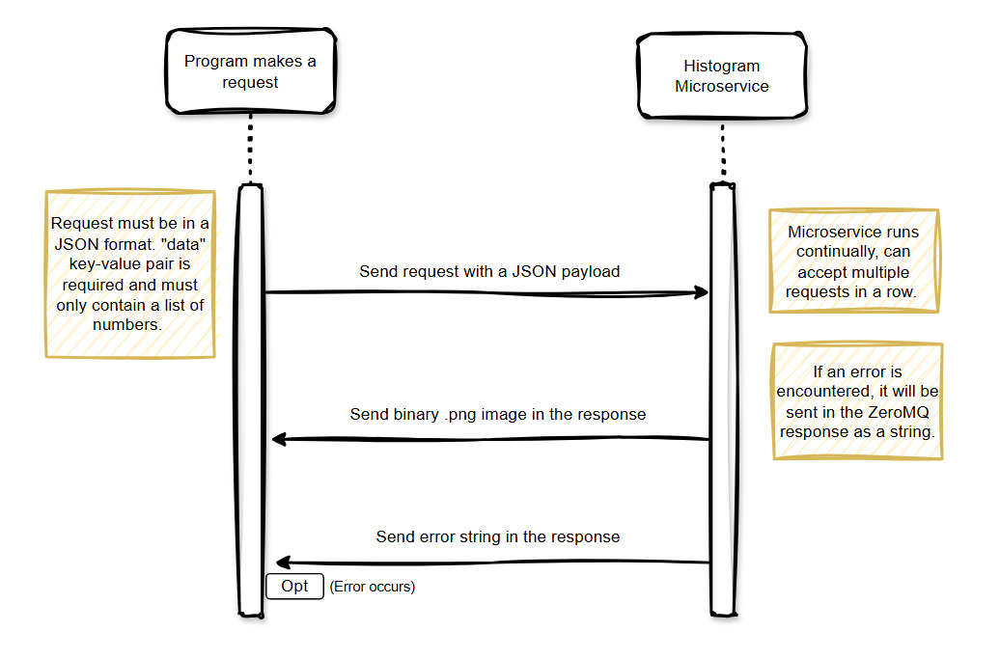

# Histogram Generator Microservice
This is a simple microservice that takes a JSON payload containing a list of numbers and returns a .png image of a generated Histogram.

## Prerequisites
This microservice is written in Python and uses ZeroMQ to communicate with the calling program. For your convenience, a requirements.txt file is included in this repository. Simply run the following, preferably in a virtual environment, to install: 

````
pip install -r requirements.txt
````

Once the requirements are installed, you can simply run the microservice locally: 

````
python miroservice.py
````

For your convenience, if the default port 5555 interferes with an existing service on your host, the port variable located at the top of microservice.py can easily be changed. 

## How to REQUEST Data:
Using ZeroMQ, connect to the microservice at tcp://localhost:5555 and send a request with a payload that adheres to JSON example provided below. 

**Example call:**
````python
# Set ZMQ context and socket connection
context = zmq.Context()
socket = context.socket(zmq.REQ)
socket.connect(f"tcp://localhost:5555")

# Sample payload
payload = {
    "data": [1, 2, 3, 4, 5],
    "title": "Histogram Title",
    "xlabel": "X Label String",
    "ylabel": "Y Label String",
    "bins": 5
}

# Send request
socket.send_json(payload)
````

The only required Key-Value pair is "data" with a corresponding list of numbers (integers or floats). The others will be set to the default values defined in microservice.py if they are not provided. 

## How to RECIEVE Data:

The microservice returns a .png of the generated histogram as raw binary data. This data can be stored in a variable and saved to a file locally. 

**Example call:**
````python
# Recieve request
response = socket.recv()

# Save image
with open("example.png", "wb") as f:
f.write(response)
````

Note: The microservice does have some minor data validation and error handling. If an error is encountered, it will be sent back in the response as a string. As a result, it is recommended to first check the content of the response for any such error so that you can handle it correctly: 

**Example Error Check:**
````python
# Check for errors
if response.startswith(b"Error"):
    print(response.decode())
else:
  <save image>
````

## UML Diagram



